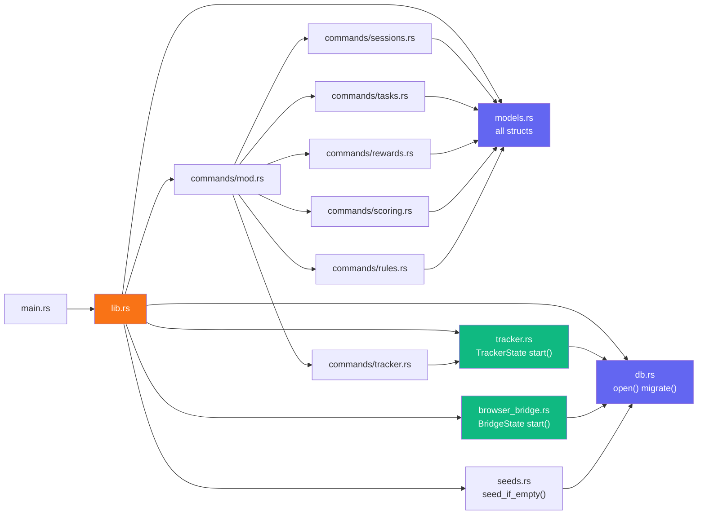
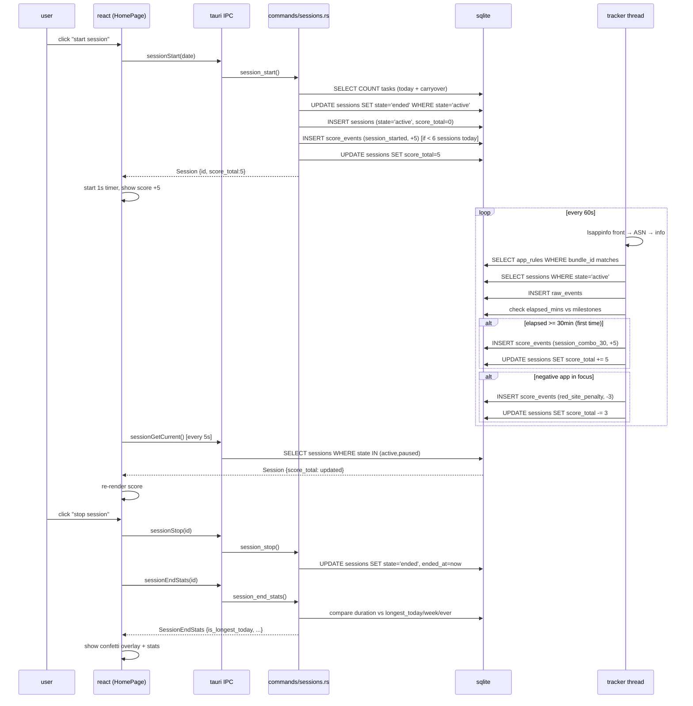
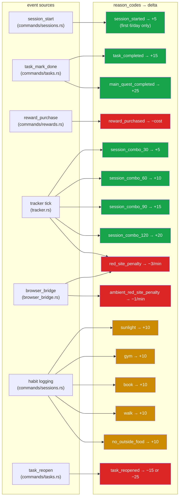

# dessert — code review graph

Three diagrams: architecture layers, module dependencies, and data flow.

---

## 1. system architecture

```mermaid
graph TB
    subgraph EXT["browser extension (MV3)"]
        content["content.js<br/>scroll/focus tracker"]
        background["background.js<br/>batch sender"]
        content -->|"active_scroll_ms samples"| background
    end

    subgraph TAURI["tauri app (macOS)"]
        subgraph THREADS["background threads"]
            tracker["tracker.rs<br/>lsappinfo + CoreGraphics<br/>60s tick loop"]
            bridge["browser_bridge.rs<br/>HTTP :43137<br/>grace period logic"]
        end

        subgraph COMMANDS["tauri command handlers"]
            sessions["commands/sessions.rs<br/>14 commands"]
            tasks["commands/tasks.rs<br/>6 commands"]
            rewards["commands/rewards.rs<br/>9 commands"]
            scoring["commands/scoring.rs<br/>3 commands"]
            rules["commands/rules.rs<br/>3 commands"]
            tracker_cmd["commands/tracker.rs<br/>1 command"]
        end

        subgraph STATE["AppState (Arc+Mutex)"]
            db["db: Arc&lt;Mutex&lt;Connection&gt;&gt;<br/>dessert.sqlite"]
            tstate["tracker: Arc&lt;Mutex&lt;TrackerState&gt;&gt;"]
            bstate["bridge: Arc&lt;Mutex&lt;BridgeState&gt;&gt;"]
        end

        subgraph DB["sqlite tables"]
            sessions_t["sessions"]
            tasks_t["tasks"]
            rewards_t["rewards"]
            inventory_t["inventory_items"]
            score_t["score_events"]
            raw_t["raw_events"]
            app_rules_t["app_rules"]
            site_rules_t["site_rules"]
            effects_t["active_effects"]
            settings_t["settings"]
            nudge_t["nudge_events"]
        end
    end

    subgraph FRONTEND["react frontend (vite :1420)"]
        subgraph LIB["lib/"]
            api["api.ts<br/>34 invoke() wrappers"]
            types["types.ts<br/>TS interfaces"]
            sounds["sounds.ts<br/>Web Audio API"]
        end

        subgraph PAGES["features/"]
            home["HomePage.tsx<br/>dashboard + session"]
            tasks_p["TasksPage.tsx<br/>quests + habits"]
            rewards_p["RewardsPage.tsx<br/>desserts shop"]
            inventory_p["InventoryPage.tsx<br/>use rewards"]
            timeline_p["TimelinePage.tsx<br/>score history"]
            settings_p["SettingsPage.tsx<br/>rules viewer"]
        end

        App["App.tsx<br/>nav + router"]
    end

    background -->|"POST /events"| bridge
    tracker -->|"Arc clone"| db
    tracker -->|"Arc clone"| tstate
    bridge -->|"Arc clone"| db
    bridge -->|"Arc clone"| bstate
    sessions -->|"state.db.lock()"| db
    tasks -->|"state.db.lock()"| db
    rewards -->|"state.db.lock()"| db
    scoring -->|"state.db.lock()"| db
    rules -->|"state.db.lock()"| db
    tracker_cmd -->|"state.tracker.lock()"| tstate

    tracker --> sessions_t
    tracker --> app_rules_t
    tracker --> score_t
    tracker --> raw_t
    bridge --> site_rules_t
    bridge --> effects_t
    bridge --> score_t
    bridge --> raw_t

    sessions --> sessions_t
    sessions --> score_t
    tasks --> tasks_t
    tasks --> score_t
    rewards --> rewards_t
    rewards --> inventory_t
    rewards --> score_t
    rewards --> effects_t
    scoring --> score_t
    scoring --> sessions_t
    rules --> app_rules_t
    rules --> site_rules_t

    api -->|"invoke() IPC"| sessions
    api -->|"invoke() IPC"| tasks
    api -->|"invoke() IPC"| rewards
    api -->|"invoke() IPC"| scoring
    api -->|"invoke() IPC"| rules
    api -->|"invoke() IPC"| tracker_cmd

    App --> home
    App --> tasks_p
    App --> rewards_p
    App --> inventory_p
    App --> timeline_p
    App --> settings_p

    home --> api
    tasks_p --> api
    rewards_p --> api
    inventory_p --> api
    timeline_p --> api
    settings_p --> api

    home --> sounds
    tasks_p --> sounds
    rewards_p --> sounds
    inventory_p --> sounds
```

---

## 2. rust module dependencies

---

## 3. frontend component → API dependencies

```mermaid
graph LR
    subgraph PAGES["pages"]
        home["HomePage"]
        tasks_p["TasksPage"]
        rewards_p["RewardsPage"]
        inventory_p["InventoryPage"]
        timeline_p["TimelinePage"]
        settings_p["SettingsPage"]
    end

    subgraph SESSION_API["session commands"]
        sessionStart["sessionStart"]
        sessionStop["sessionStop"]
        sessionPause["sessionPause"]
        sessionResume["sessionResume"]
        sessionGetCurrent["sessionGetCurrent"]
        dayPlanningStatus["dayPlanningStatus"]
        sessionEndStats["sessionEndStats"]
        logSunlight["logSunlight"]
        logGym["logGym"]
        logBook["logBook"]
        logWalk["logWalk"]
        logNoOutsideFood["logNoOutsideFood"]
        unlogHabit["unlogHabit"]
    end

    subgraph TASK_API["task commands"]
        taskCreate["taskCreate"]
        taskMarkDone["taskMarkDone"]
        taskReopen["taskReopen"]
        taskDelete["taskDelete"]
        taskUpdate["taskUpdate"]
        taskListForDate["taskListForDate"]
    end

    subgraph REWARD_API["reward commands"]
        rewardList["rewardList"]
        rewardCreate["rewardCreate"]
        rewardUpdate["rewardUpdate"]
        rewardDelete["rewardDelete"]
        rewardPurchase["rewardPurchase"]
        inventoryListAvailable["inventoryListAvailable"]
        inventoryListConsumed["inventoryListConsumed"]
        inventoryConsume["inventoryConsume"]
    end

    subgraph SCORE_API["scoring commands"]
        scoreGetToday["scoreGetToday"]
        scoreGetOverall["scoreGetOverall"]
        timelineGetForDay["timelineGetForDay"]
    end

    home --> sessionStart
    home --> sessionStop
    home --> sessionPause
    home --> sessionResume
    home --> sessionGetCurrent
    home --> sessionEndStats
    home --> dayPlanningStatus
    home --> logSunlight
    home --> logGym
    home --> taskMarkDone
    home --> taskCreate
    home --> taskListForDate
    home --> scoreGetToday
    home --> scoreGetOverall
    home --> trackerGetStatus["trackerGetStatus"]

    tasks_p --> taskCreate
    tasks_p --> taskMarkDone
    tasks_p --> taskReopen
    tasks_p --> taskDelete
    tasks_p --> taskUpdate
    tasks_p --> taskListForDate
    tasks_p --> dayPlanningStatus
    tasks_p --> logSunlight
    tasks_p --> logGym
    tasks_p --> logBook
    tasks_p --> logWalk
    tasks_p --> logNoOutsideFood
    tasks_p --> unlogHabit

    rewards_p --> rewardList
    rewards_p --> rewardCreate
    rewards_p --> rewardUpdate
    rewards_p --> rewardDelete
    rewards_p --> rewardPurchase
    rewards_p --> sessionGetCurrent
    rewards_p --> scoreGetOverall

    inventory_p --> inventoryListAvailable
    inventory_p --> inventoryListConsumed
    inventory_p --> inventoryConsume
    inventory_p --> sessionGetCurrent

    timeline_p --> timelineGetForDay
    timeline_p --> scoreGetToday
    timeline_p --> scoreGetOverall

    settings_p --> rulesGetAll["rulesGetAll"]
```

---

## 4. data flow: session lifecycle

---

## 5. scoring events map

